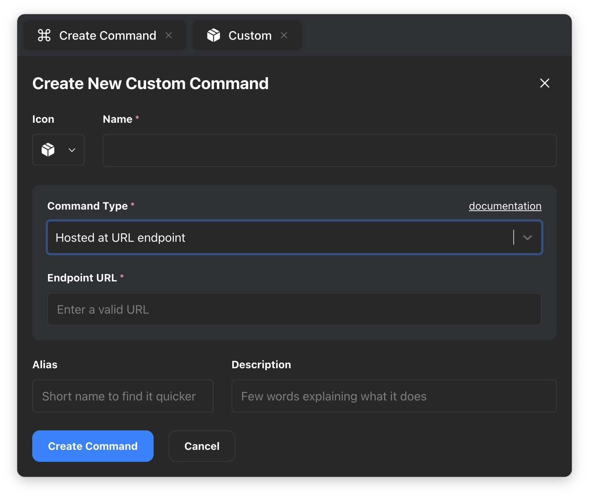
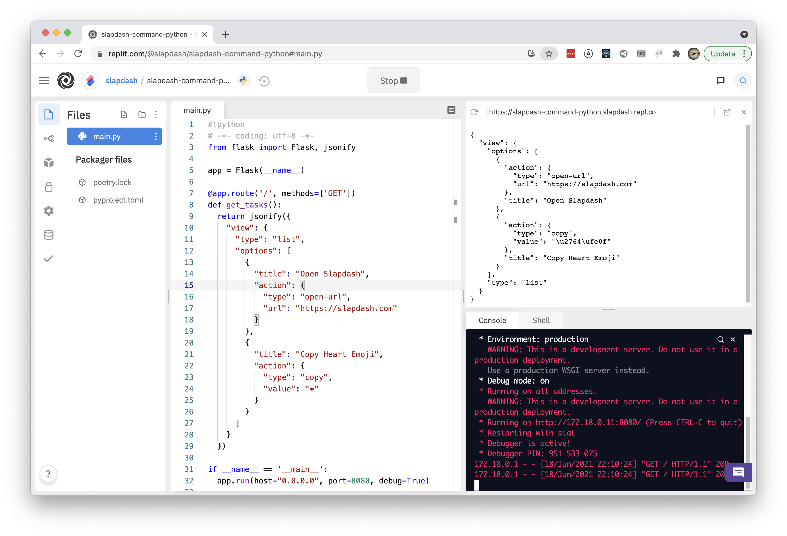

# Cloud Commands

Cloud commands are hosted at URL endpoints. Slapdash makes HTTPS requests to the endpoint and interprets the JSON-encoded [Command Response](../reference/command-response.md).  
  
Commands that run in the cloud can't make any changes to your computer \(it's just JSON over HTTPS after all\), so they are a safe way to share Command Bar functionality with others.

## Create Cloud Command

To create a cloud command, run **Create Command** in the Command Bar and choose **Hosted at URL endpoint** from the **Command Type** dropdown. Here you'll be able to paste the URL endpoint of your command.



## Developing & Deploying with Replit

One of our favorite ways to host and develop cloud commands is with [Replit](https://replit.com/).   
  
We like it because we can use any programming language to write the command, and we can do the development directly in the browser. It's a super quick way to get an HTTPS endpoint up and running with just a few clicks.  
  
**Fork Example**

The fastest way to start is to fork another Repl. Here are a few examples you can choose from:

* [Basic Python Example](https://replit.com/@slapdash/slapdash-command-python)
* [Send Slack Message](https://replit.com/@slapdash/send-slack-message)

**Run Command**

After forking the Repl, hit the **Run** button to make sure the associated HTTPS endpoint is accessible.  
  
Find the endpoint URL in the top-right panel. This is the URL you will use to create the command inside Slapdash.



  
**Deploying & Sharing Command**  
  
By default, Repls aren't always running. If you plan to use the command often or to share it with others, you'll need to make sure the Repl is set to be **Always On.**  


## Deploying with Vercel

You can also use Vercel to deploy a command as a [Serverless Function](https://vercel.com/docs/serverless-functions/introduction).

Start by creating a **New Project** inside Vercel and choose the **NextJS template**.

Create a new file in the project under `pages/api/ahoy-world.js`.

Then, add the following sample code and push to your repository to deploy it.

```javascript
module.exports = async (req, res) => {
  const response = {
    view: {
      type: "list",
      options: [
        {
          title: "Open Slapdash",
          action: {
            type: "open-url",
            url: "https://slapdash.com"
          }
        },
        {
          title: "Copy Heart Emoji",
          action: {
            type: "copy",
            value: "❤️"
          }
        }
      ]
    }
  };
  res.setHeader("Access-Control-Allow-Headers", "*"); // for config headers
  res.setHeader("Access-Control-Allow-Origin", "*");
  res.json(response);
}
```

At this stage, you should have a functioning URL like `https://nextjs-***.vercel.app/api/ahoy-world` that you can use to create a command in Slapdash.

