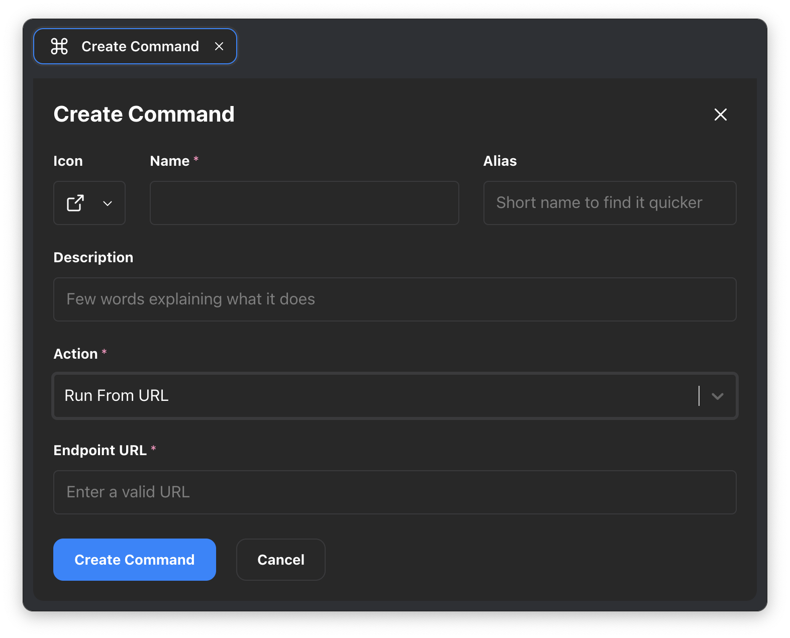
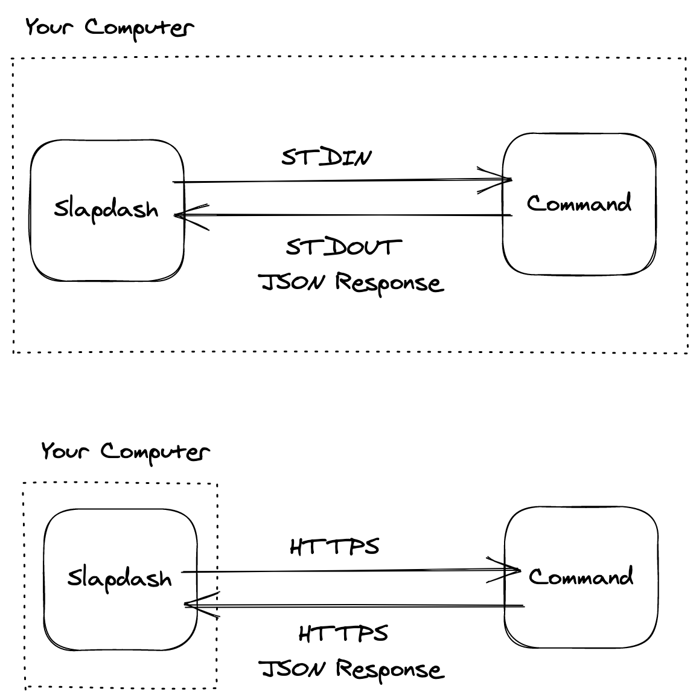

# How Commands Work

### Commands are Functions

The easiest way to think about commands is as functions. Like a function, it can accept arguments as input and can return some output.

```text
Command(Input) -> Output
```

Like a function, a command doesn't have to return anything. Imagine a command to put your computer to sleep: there is no output that's needed. However, most commands have an output, which provides feedback to the person running the command.

The output is a JSON-serialized data structure that conforms to the [Command Response Specification](https://www.notion.so/Command-Response-Reference-9974147df61649fab52eb4238d775c57). The Command Response tells the Command Bar what to do. For example, copy something to the clipboard, open a URL in the browser, or provide a rich interactive experience that takes advantage of the interaction primitives found in the Command Bar.

### Local vs. Cloud Commands

There are two types of commands: local commands, which are scripts that run on your computer, and cloud commands, which are commands that are hosted on the web.

They are mostly the same, but they do offer some trade-offs:

| **Local Commands** | **Cloud Commands** |
| :--- | :--- |
| Script on your computer | Accessible by URL |
| Can do whatever your computer can | No direct access to your computer |
| Not shareable with team | Shareable with team |
| Great for development | Great for production deployment |

When developing a new command, local commands are the fastest and simplest way to get things going.

### Local Commands

To create a local command, run Create Command and choose Run from File from the Action dropdown. Here you'll be able to select the script file from your computer.

Slapdash knows how to execute bash, node \(JavaScript and TypeScript\), Apple Script files and other languages which may be installed on your computer \(Python, PHP etc.\). Also, because Slapdash can execute bash, you can use any language to write your command and just create a bash wrapper to call into your program.


### Cloud Commands

To create a cloud command, run **Create Command** and choose **Run from URL** from the Action dropdown.

To speak with cloud commands, Slapdash makes HTTPS requests and interprets the returned JSON that conforms to the [Command Response Specification](https://www.notion.so/Command-Response-Reference-9974147df61649fab52eb4238d775c57) to build the view.



### Local and Cloud Commands are Similar



