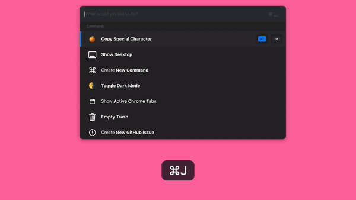

# Copy Special Character



This command illustrates an [interactive List](../reference/command-response-view-list.md), as well as using **Tab** to navigate to another location within the command.

In this case, hitting **Enter** on an Option will copy the special character, while hitting **Tab** will show another view letting someone choose to copy the hex value instead.

```javascript
/*
 * A command that shows special characters. Hitting Enter
 * will copy character, hitting Tab will give other ways
 * to copy the character: HTML hex code, for example.
 */

/**
 * Gets arguments passed in to script, like: --character=control
 * and stores it into an array, like: args['character'] = "control".
 */
const args = process.argv.slice(2).reduce((agg, arg) => {
  const match = arg.match(/^--(?<key>\w+)=(?<value>.+)$/);
  return match ? { ...agg, [match.groups.key]: match.groups.value } : agg;
}, {});

let response;
if (args["character"]) {
  response = showOptionsForCharacter(args["character"]);
} else {
  response = showAllCharacters();
}
console.log(JSON.stringify(response));

/*
 * The view that is shown when someone runs the command.
 */
function showAllCharacters() {
  const response = {
    view: {
      type: "list",
      options: [
        {
          title: "Command",
          action: {
            type: "copy",
            value: "⌘",
          },
          moveAction: {
            type: "add-param",
            name: "character",
            value: "command",
          },
        },
        {
          title: "Option",
          action: {
            type: "copy",
            value: "⌥",
          },
          moveAction: {
            type: "add-param",
            name: "character",
            value: "option",
          },
        },
        {
          title: "Control",
          action: {
            type: "copy",
            value: "️️⌃",
          },
          moveAction: {
            type: "add-param",
            name: "character",
            value: "control",
          },
        },
      ],
    },
  };
  return response;
}

/**
 * The view that is shown when someone Tabs on a character.
 */
function showOptionsForCharacter(character) {
  const charactersToHex = {
    command: "&#8984;",
    option: "&#8997;",
    control: "&#8963;",
  };
  return {
    tokens: [
      {
        paramName: "character",
        label: character,
        icon: "🎹",
      },
    ],
    view: {
      type: "list",
      options: [
        {
          title: "Copy Hex",
          action: {
            type: "copy",
            value: charactersToHex[character],
          },
        },
      ],
    },
  };
}
```

[See on Github](https://github.com/slapdash/platform/tree/main/tutorials/copy-special-character)

