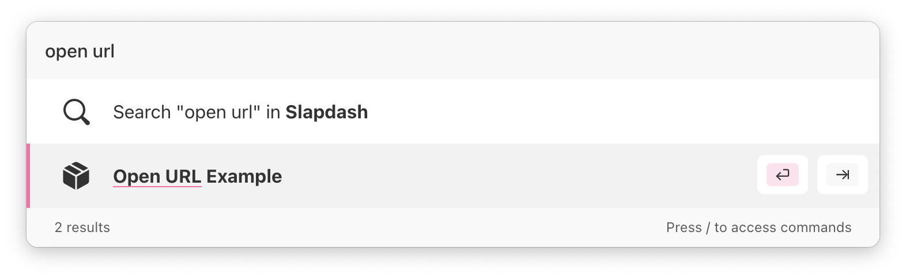
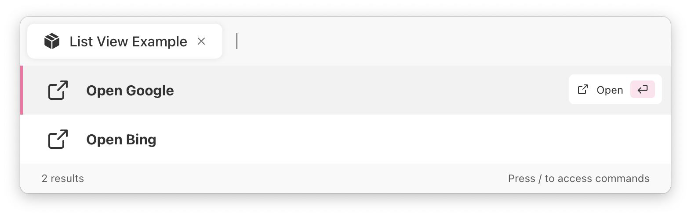
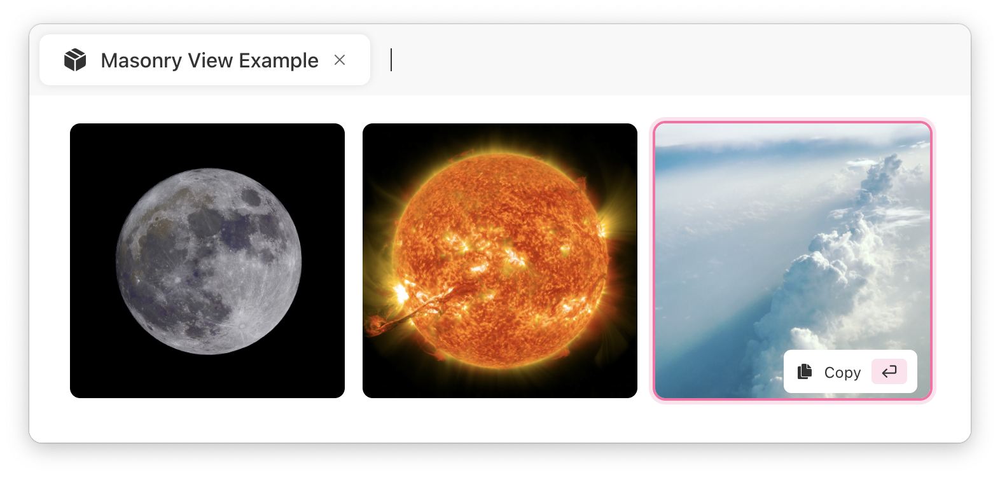
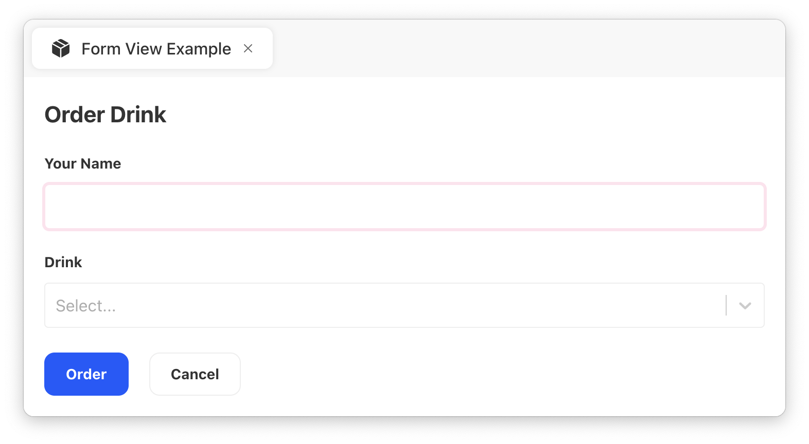
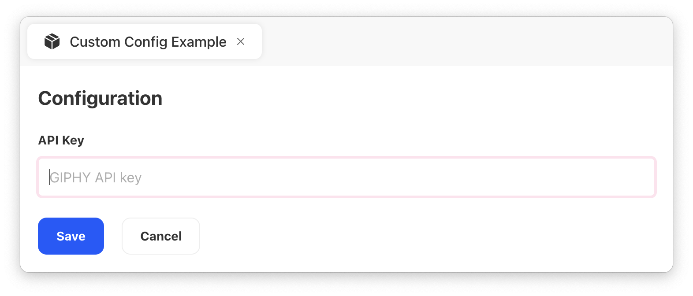

# Command Response

A command should return a JSON that tells what the Command Bar should show or do. The JSON needs to conform to a certain format, which can be described with the TypeScript definition below.

```typescript
interface CommandResponse {
  /**
   * Optional.
   * A side effect of the Command when it's run.
   */
  action?: Action;

  /**
   * Optional.
   * The View the Command Bar should display
   * (List, Form etc.).
   */
  view?: View;

  /**
   * Optional.
   * A way to configure the command before it can
   * be used. For example, to collect an API key.
   */
  config?: Config;

  /**
   * Optional.
   * A way to customize how Command Bar tokens
   * that are visualized.
   */
  tokens?: Token[];

  /**
   * Optional.
   * The placeholder text in the Command Bar's input.
   */
  inputPlaceholder?: string;
}
```

## Quick Examples

The simplest way to experiment with commands is to copy one of the examples below to a file with `*.js` extension and then create a [Local Command](../command-bar-101/local-commands.md) in the [Slapdash desktop app](https://slapdash.com/download).



```javascript
// https://github.com/slapdash/platform/blob/main/docs/reference/open-url.js
console.log(
  JSON.stringify({
    action: {
      type: "open-url",
      url: "https://slapdash.com/",
    },
  })
);
```

When selected in the Command Bar, the command just opens a particular URL in the browser:





```javascript
// https://github.com/slapdash/platform/blob/main/docs/reference/list-view.js
console.log(
  JSON.stringify({
    view: {
      type: "list",
      options: [
        {
          title: "Open Google",
          action: {
            type: "open-url",
            url: "https://www.google.com/",
          },
        },
        {
          title: "Open Bing",
          action: {
            type: "open-url",
            url: "https://www.bing.com/",
          },
        },
      ],
    },
  })
);
```

The command shows the list of options. Each option has an associated Action \(in this example, the actions are to open URLs\):





```javascript
// https://github.com/slapdash/platform/blob/main/docs/reference/masonry-view.js
console.log(
  JSON.stringify({
    view: {
      type: "masonry",
      options: [
        {
          imageURL:
            "https://images.unsplash.com/photo-1481819613568-3701cbc70156",
          action: {
            type: "copy",
            value: "Moon",
          },
        },
        {
          imageURL:
            "https://images.unsplash.com/photo-1614642264762-d0a3b8bf3700",
          action: {
            type: "copy",
            value: "Sun",
          },
        },
        {
          imageURL:
            "https://images.unsplash.com/photo-1512361180836-1ecddb33f2dd",
          action: {
            type: "copy",
            value: "Sky",
          },
        },
      ],
    },
  })
);
```

Similar to the List View, but shows the images in a Masonry grid:





```javascript
// https://github.com/slapdash/platform/blob/main/docs/reference/form-view.js
console.log(
  JSON.stringify({
    view: {
      type: "form",
      title: "Order Drink",
      submitLabel: "Order",
      fields: [
        {
          type: "text",
          id: "name",
          label: "Your Name",
        },
        {
          type: "select",
          id: "drink",
          label: "Drink",
          options: ["Cappuccino", "Latte", "Green Tea", "Coke"],
        },
      ],
    },
  })
);
```

The command shows a form and allows the user to enter some data. When the form is submitted, the command is run again, and the entered data is passed as JSON to its STDIN.





```javascript
// https://github.com/slapdash/platform/blob/main/docs/reference/custom-config.js
console.log(
  JSON.stringify({
    config: {
      form: {
        fields: [
          {
            type: "text",
            id: "api-key",
            label: "API Key",
            placeholder: "GIPHY API key",
          },
        ],
      },
    },
  })
);
```

Emitting `config` property allows the command to request some private configuration data from the user when it is first executed. Later, the configuration is passed back to the command via process environment variables.





